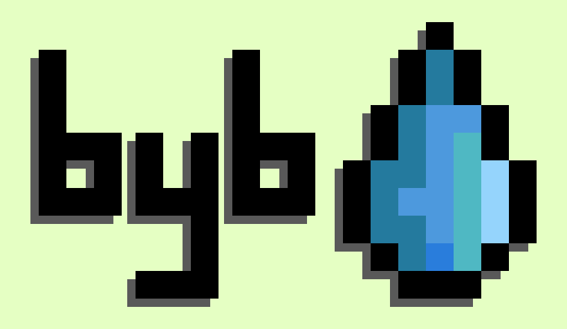

# backyardbot

<p align="center">
  
</p>

Automatic gardening server that keeps plants alive. Comes with a plugin system to improve expandability and adapt to every garden or balcony.


## About

backyardbot consists of several plugins and an architecture definition that enables those plugins to work together to create an application for a specific use-case.

The architecture of the components that are specific to backyardbot are described below. It uses a framework that supplies functionality for a plugin based system. The plugins can communicate with one another, provide functionality in form of a python backend or a web-based frontend. There is also databases available to store persistent information.

## Example Use-Case

The example below shows backyardbot's configuration for four sprinklers. The `settings.json` files given in each plugin and the one that is global to the system resemble this setup.


## Install and Run

```bash
pip3 install aiohttp jinja2 tinydb

# To control the Raspberry Pi's GPIO:
pip3 install wiringpi

git clone https://github.com/montioo/backyardbot.git
```

Then adjust the configuration files:
- [`plugins/sprinklerinterface/settings.json`](plugins/sprinklerinterface/settings.json): Settings regarding the sprinklers that are controlled via pumps or magnetic valves.
- [`byb/settings.json`](byb/settings.json): Can mostly be used like this. Contains general settings.

Then you can launch backyardbot with:
```bash
cd backyardbot

python3 launch_byb.py
```

## Adapting the System to your Needs

Every plugin as well as the components in the framework folder come with their own readme files where the component's functionality is explained. Depending on your sprinklers and how you intend to control them, it might be enough to change some preferences in the `settings.json` files mentioned above.

If this is not enough to adapt backyardbot to your use-case, have a look at the [development info](development_info.md). There you will find descriptions of the system's architecture and how to approach plugin or actuator development.

If you make any improvements to the system feel free to open a merge request from your fork.
